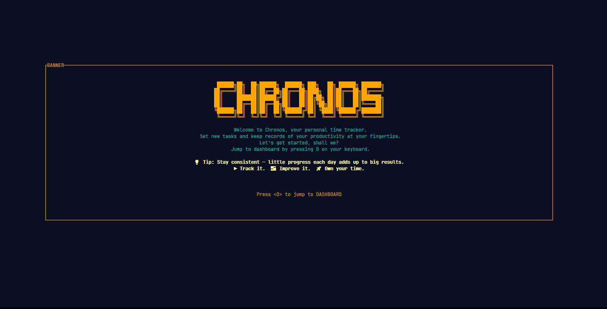
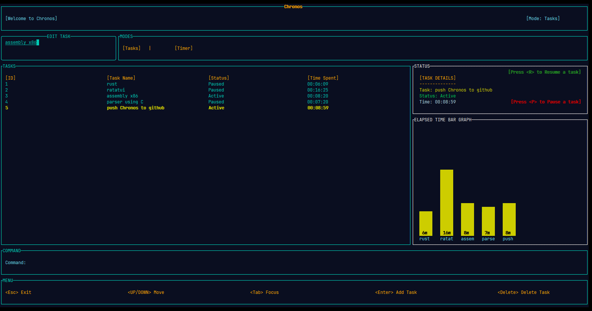
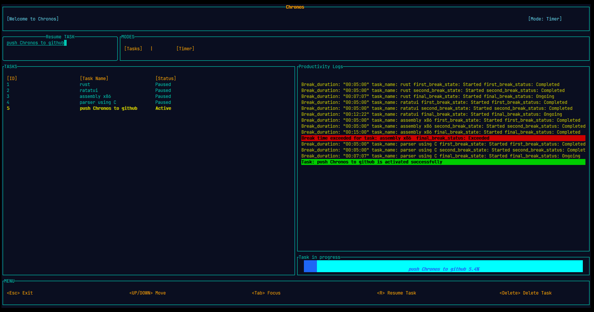

# ⏳ Chronos  
### A Terminal-First Time Tracking CLI Built with Rust

Chronos is a **TUI (Terminal User Interface) based time-tracking application** written in **Rust**, designed for developers and power users who prefer tracking their work directly from the terminal.

Chronos focuses on **intentional time usage** by combining tasks, timers, breaks, and visual feedback into a single cohesive workflow.

---

## 🧠 Core Idea

> *You don’t manage time. You manage attention.*

Chronos is built around three principles:

- **Minimal & distraction-free UI**
- **Explicit task-based time tracking**
- **Clear visual feedback for reflection**

Instead of passively running in the background, Chronos makes time tracking a **conscious action**.

---

## 🖥️ Application Structure & UI Flow

Chronos is composed of **three UI layers**, each implemented in its own Rust module and rendered inside the terminal:

| UI Screen | Rust File | Responsibility |
|---------|-----------|---------------|
| Banner Screen | `banner.rs` | Branding, motivation, session context |
| Task Manager | `task.rs` | Task creation, selection, lifecycle |
| Timer & Analytics | `timer.rs` | Live timing, breaks, session stats |

The user flows naturally through these screens during a session.

---

## 🟡 Banner Screen (`banner.rs`)

The Banner screen is the **entry point** of Chronos.

It introduces the philosophy of the tool and sets the mental context before any task begins.  
This screen reinforces the core workflow:

- Track your time
- Improve your focus
- Own your schedule

The banner exists to ensure that tracking time is a **deliberate decision**, not an automatic habit.

---

## 🟦 Task Manager (`task.rs`)

The Task Manager is the **operational core** of Chronos.

Before starting a timer, users must define *what* they are working on.  
Every tracked session is explicitly tied to a task.

### Capabilities
- Create and display tasks
- Resume paused tasks
- Delete tasks
- Navigate entirely using the keyboard
- Switch between task and timer modes

### Keyboard Controls
- `<Up / Down>` — Navigate tasks  
- `<Tab>` — Switch focus  
- `<R>` — Resume selected task  
- `<Delete>` — Delete task  
- `<Esc>` — Exit application  

This design makes Chronos ideal for **keyboard-driven workflows**, SSH sessions, and tiling window managers.

---

## 🔴 Timer & Analytics (`timer.rs`)

The Timer screen handles **active time tracking and visualization**.

Once a task is started, Chronos displays:

- Live elapsed time
- Break durations
- Current task state
- Session status indicators
- A visual elapsed-time bar graph

### Session States
Chronos explicitly tracks task states such as:
- Started
- Completed
- Ongoing
- Exceeded

Breaks are treated as **first-class entities**, not hidden pauses, enabling better reflection on work patterns.

---

## 🦀 Code Architecture

Chronos follows a **clean, modular Rust architecture**:

src/
├── banner.rs   # Branding and philosophy UI
├── task.rs     # Task lifecycle and navigation
├── timer.rs    # Time tracking, breaks, analytics
└── main.rs     # Application orchestration

## 🧩 Architecture Philosophy

Each module:

- Owns its UI logic
- Manages its state explicitly
- Avoids unnecessary coupling

This keeps the codebase readable, extensible, and maintainable.

---

## 🚀 Getting Started

### Prerequisites

- Rust (stable)
- Cargo

### Build
cargo build --release

### Run
cargo run

## 🛠️ Future Scope

 - Persistent session storage
  
 - Export reports (CSV / JSON)
  
 - Theme customization
  
 - Multi-day analytics
  
 - Pomodoro presets

## ✨ Final Thought

 - Chronos isn’t about working longer.
 - It’s about working deliberately.
